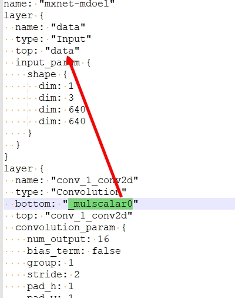

# RetinaFaceAntiCov Implementation with opencv caffe C++ 
vs2015 opencv caffe c++口罩检测

#### 0x01:result

#### 0x02 modle convert
参考：https://github.com/cypw/MXNet2Caffe

过程:

python json2prototxt.py --mx-json=./mnet_cov2-symbol.json --cf-prototxt=./mnet_cov2.prototxt

把prototxt中conv_1_conv2d层的输入_mulscalar0改成data，不然会报错：

python mxnet2caffe.py --mx-model=./mnet_cov2 --cf-prototxt=./mnet_cov2.prototxt --cf-model=./mnet_cov2.caffemodel

这里说一下这个网络设计的不足：

mask的anchor有可能跟cls的anchor不在同一stride时，会导致mask置信度不对。

#### 0x03:Note
依赖opencv4.51环境，须配置相关目录：

#### 0x04:Reference
官方RetinaFaceAntiCov：

https://github.com/deepinsight/insightface/tree/master/detection/RetinaFaceAntiCov

无口罩版(源码参考)：
https://github.com/lcings/opencv_retinaface
